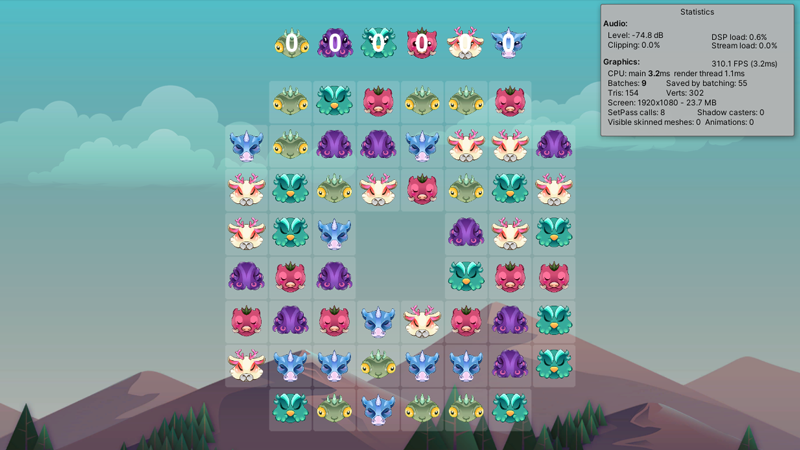

# Match3Core

Match3Core是基于Unity3D开发，可快速创建三消游戏核心的工具包，并提供示例游戏和关卡编辑器。  
其中/Runtime/BoardGrid.cs实现布局算法、消除算法、匹配检测、下落填充等逻辑，通过事件回调机制对表现层进行解耦，没有依赖Unity相关类，便于开发者快速集成和定制。  
示例游戏的原始素材来自：[CraftPix精灵](https://craftpix.net/freebies/free-monsters-for-match-3-game)、[CraftPix背景](https://craftpix.net/freebies/free-horizontal-2d-game-backgrounds)，因动画图片较多，若直接使用，则产生大量DrawCall，而影响性能，已被优化成图集。  
演示地址：[WebGL](https://qq306041575.github.io/Match3Core)  

## 安装
在Unity编辑器的主菜单中，点击Windows/Package Manager打开包管理器窗口，点击 + 按钮打开选项，选择Add package from git URL...，填入https://github.com/qq306041575/Match3Core.git  

## 场景
Game.unity示例游戏，拖动相邻元素进行位置交换，或勾选Game组件的Auto自动交换，当五连消除时会出现同色炸弹，当四连消除时会出现直线炸弹，当T型或L型消除时会出现3x3范围炸弹。  
Level.unity关卡编辑器，点击鼠标左键切换元素，点击鼠标右键删除元素，数据会作为ScriptableObject资产，实时自动保存在LevelData.asset。  

## 截图
  
